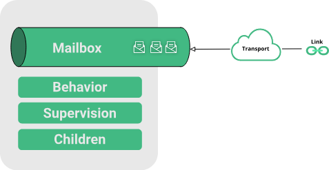
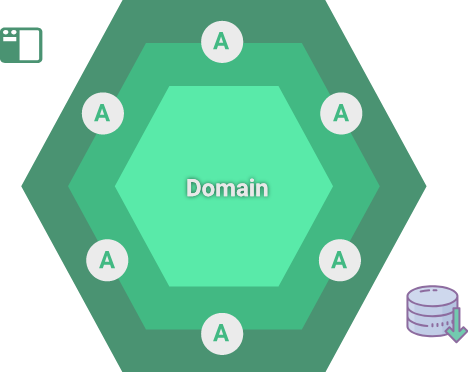
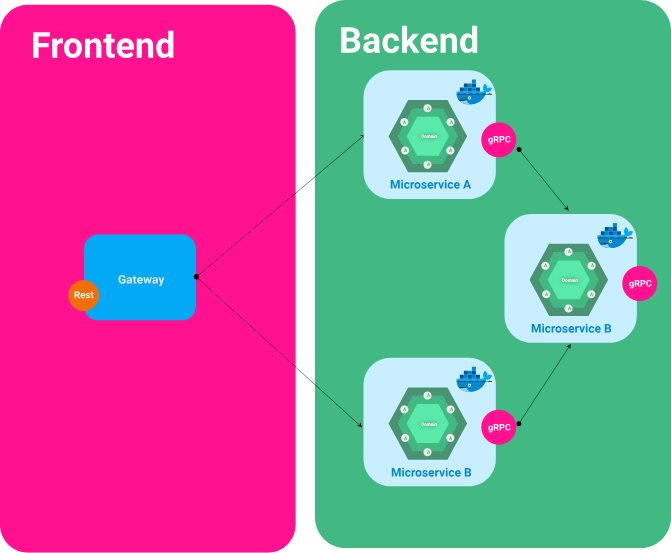

# MLambda Actors
MLambda Actors is one of the implementation of the actor models for 
**DotNet Core** and **Kotlin** technology.

There are many implementations of the actor model as 
[AKKA.net](https://getakka.net/), [Orleans](https://dotnet.github.io/orleans) and [Proto Actor](http://proto.actor).
But all of these implementations are hard to understand, and don't provide a a clean architecture.
Our vision is create a simple, lightweight library for compute the actors models, designing it
using Solid Principles.

>Note: as Hexagonal architecture define: Restful, gRPC, WebSockets are ports and don't define an architecture. 
>We want to provide the more simple concept to understand actors, and dont compromise the
>design with a specific port, for us the actors are the Application layer on DDD.

See the [architecture](site/architecture.md)

The mission of this framework is to provide a base to define **Hexagonal Architecture**.

In the development of the microservices, there are many paradigms about how it is implemented,
we know that a Microservice has the own database and the code should be small that allow to 
refactor the code in at least two weeks

These are some pragmatical criteria, but there is not a unification theory about microservices, but
for my perspective the close architecture that can helps us to define a precise microservices is based
on *agile* methodology and clean architectures as Hexagonal Architecture.

> Note: Alistair Cockburn define the Hexagonal Architecture [About it](https://alistair.cockburn.us/hexagonal-architecture/)

Some design principles that can help us to governs the structure is Domain Driven Design.

The principles are:

1. There are bounded context, it is a bunch of entities aggregations.
2. There are entities and value objects, Entities has a unique identity, the value objects are
types that don't have a identity, it is base in the internal state.
3. The Domain core don't have any access to the persistence.
4. The state is persisted using the repository pattern.

 

In order to provide a solid Microservices architecture, the actor model is going to handle the applications layer,
Using actor allow to design a resilient, robustness, persisted handles message. An actor model 
has a mailbox and for some exceptions the actor
use supervision that helps to recover for failure scenarios. 

In order to define a Microservices Architecture there are some patterns that should be provided as:
[Microservices Patterns](https://microservices.io/patterns/microservices.html)

- Data
    - Database Per service. 
- Communication:
    - Api Gateway
    - Messaging 
    - Remote invocation
- Discovery
    - Client Side Discovery
    - Server Side Discovery
    - Circuit Breaker
- Observability 
    - Health Check API
    - Distribute tracing

Now we are going to define how actors can help to achieve this patterns:

**Database Per service**: Defining DDD we are going to provide Context Bounded, that means that every context bounded
has to have her own data base and her own container.

**Api Gateway** It is not important due Kubernetes handle this part with the Ingress.

**Messaging** Actor model is design to decoupling the message for the process, that means every actor use
an persisted resilience mailbox, it not necessary to use a streaming-broker technology as [Kafka](https://kafka.apache.org/) or
[Rabbit MQ](https://www.rabbitmq.com/)  or other messaging system. 

> Note: If you are using this kind of technology, it is probably that you have implemented an actor model.

**Remote invocation** The actor model allow you can define remote address in order to communicate to the 
actors.

**Client Side Discovery** it is handle by kubernetes.

**Server Side Discovery** it is handle by kubernetes.

**Circuit Breaker** it is handle by kubernetes.

**Health Check API** it is handle by kubernetes.

**Distribute tracing** it is handle by the actors, the actors is going to handle tha monitoring, this
framework is using [Jaeger](https://www.jaegertracing.io/)

This kind of the architectures is compromise with the [reactive manifest](https://www.reactivemanifesto.org/)