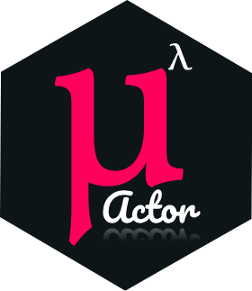

# MLambda Actors <small>1.0</small>

The actor model is a mathematical theory of computation that treats "Actors" as 
universal primitives of concurrent digital computation 

 > [Hewitt, Bishop and Steiger 1973; Hewitt 1977]
 
 [Get Started](README.md) [Actors](https://www.youtube.com/watch?v=7erJ1DV_Tlo)

